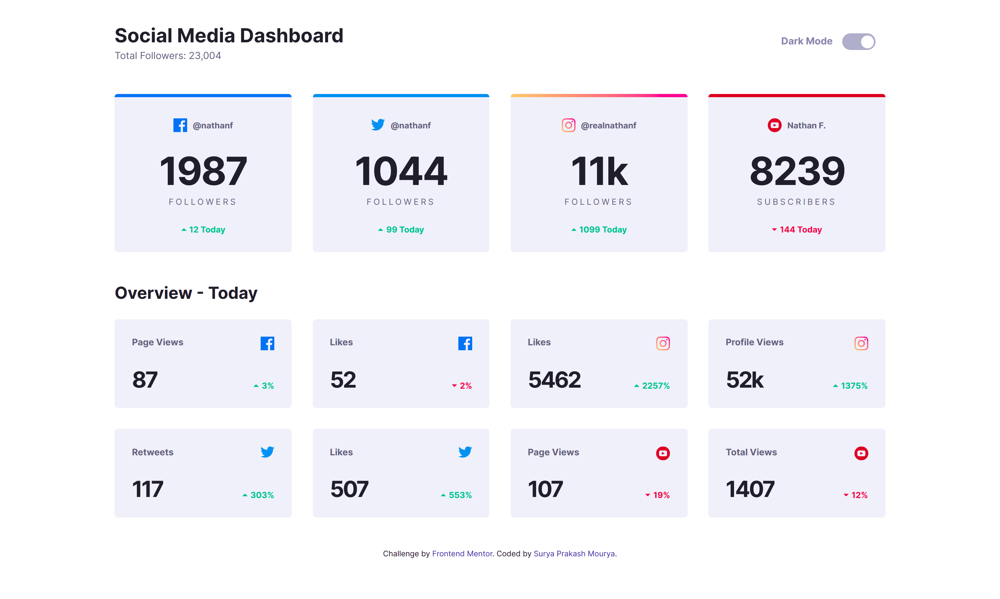
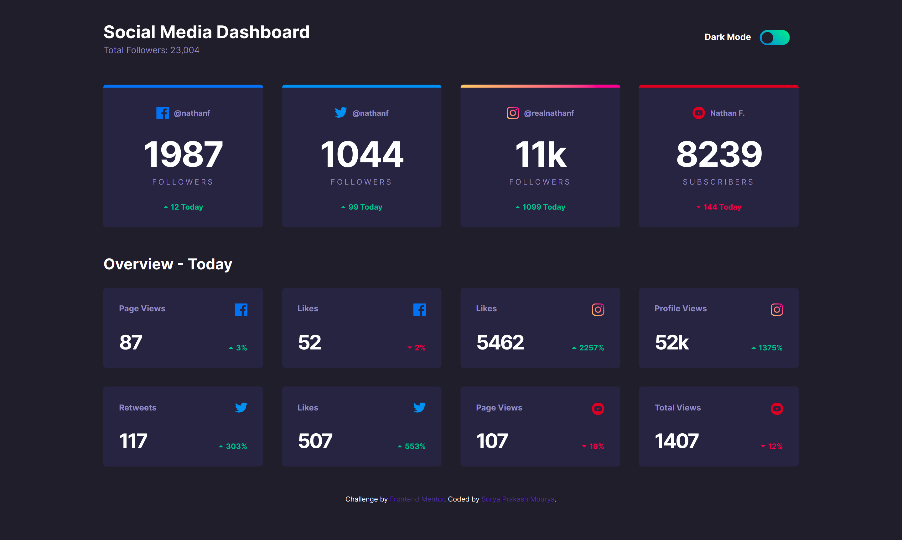
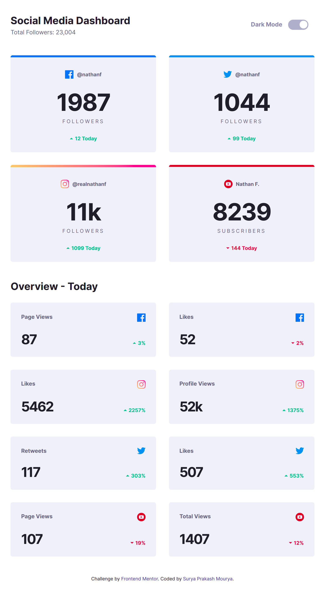
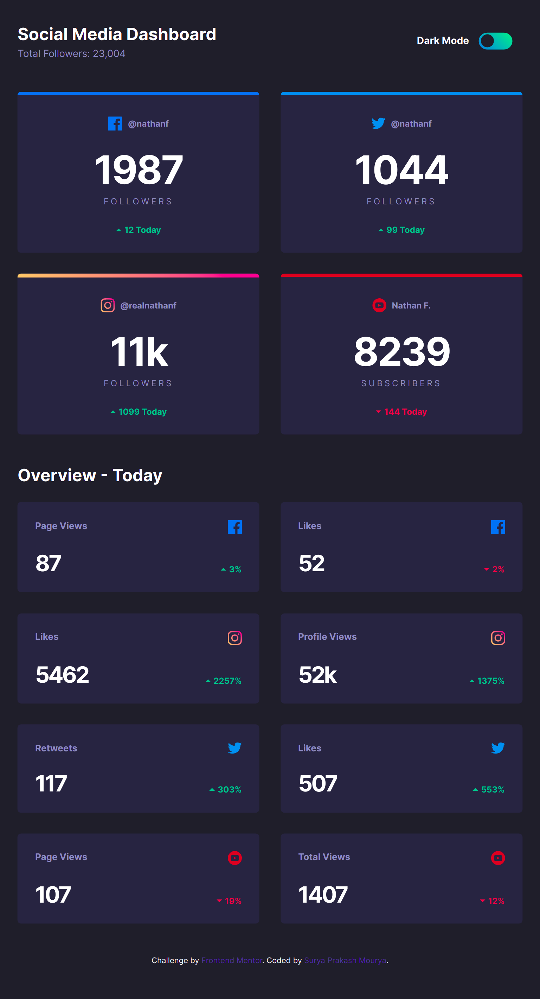
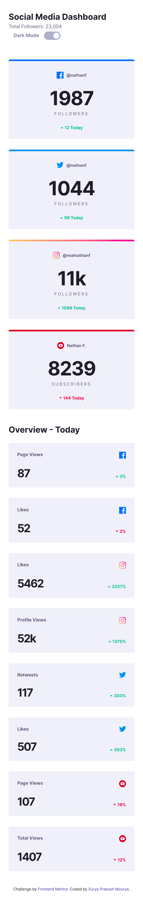
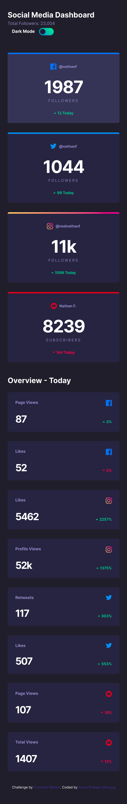

# Frontend Mentor - Social media dashboard with theme switcher solution

This is a solution to the [Social media dashboard with theme switcher challenge on Frontend Mentor](https://www.frontendmentor.io/challenges/social-media-dashboard-with-theme-switcher-6oY8ozp_H). Frontend Mentor challenges help you improve your coding skills by building realistic projects. 

## Table of contents

- [Overview](#overview)
  - [The challenge](#the-challenge)
  - [Screenshot](#screenshot)
  - [Links](#links)
- [My process](#my-process)
  - [Built with](#built-with)
  - [What I learned](#what-i-learned)
  - [Continued development](#continued-development)
  - [Useful resources](#useful-resources)
- [Author](#author)
- [Acknowledgments](#acknowledgments)

**Note: Delete this note and update the table of contents based on what sections you keep.**

## Overview

### The challenge

Users should be able to:

- View the optimal layout for the site depending on their device's screen size
- See hover states for all interactive elements on the page
- Toggle color theme to their preference

### Screenshot


Desktop-Light



Desktop-Dark



IPad Light



IPad Dark



I Phone Light



I Phone Dark




### Links

- Solution URL: [Github](https://github.com/mauryahdx/FEM-Social-Media-Dashboard)
- Live Site URL: [Github Pages](https://mauryahdx.github.io/FEM-Social-Media-Dashboard/)

## My process

### Built with

- Semantic HTML5 markup
- SASS/SCSS
- BEM
- Gulp
- Mobile-first workflow
- Javascript


**Note: These are just examples. Delete this note and replace the list above with your own choices**

### What I learned

With this project I have learnt more about BEM(Block Element Modifier) class naming convention which makes life easier for developer by naming classes with a convenient structure. I also got to learn about the local storage where we can store user infos and preferences locally and use the data for making user experience much better.

As '@import' keyword is being depricated in sass so in this project i have lernt the use of keywords '@forward' and '@use'.

I am attaching the code snippets of the above mentioned things below:


```scss
@use '../util' as *;

.cards{
    display: grid;
    grid-template-columns: 1fr;
    gap: rem(30);

    @include breakpoint-up(medium){
        grid-template-columns: repeat(2, 1fr);
    }
    @include breakpoint-up(large){
        grid-template-columns: repeat(4, 1fr);
    }
}

.card {
    flex: 1;
    background: var(--card-bg);
    color: var(--text-color2);
    //width: rem(255);
    text-align: center;
    padding: rem(25);
    border-radius: rem(5);
    position: relative;
    overflow: hidden;
    transition: background 150ms ease-in-out;
    cursor: pointer;

    &:hover {
        background: var(--card-hover);
    }

    &--facebook {
        border-top: rem(5) solid var(--facebook);
    }

    &--twitter {
        border-top: rem(5) solid var(--twitter);
    }

    &--instagram {
        padding-top: rem(30);
        &::before {
            content: '';
            height: rem(5);
            width: 100%;
            position: absolute;
            display: block;
            left: 0;
            top: 0;
            background: linear-gradient(45deg, var(--instagram-start), var(--instagram-end));
        }
        border-top: rem(5) solid linear-gradient(var(--instagram-start), var(--instagram-end));
    }

    &--youtube {
        border-top: rem(5) solid var(--youtube);
    }

    &--grid {

    }

    &__subtitle {
        font-size: rem(13);
        font-weight: 700;
        
    }

    &__platform {
        display: flex;
        justify-content: center;
        align-items: center;
        margin-top: rem(5);
        margin-bottom: rem(28);
        height: rem(20);
    }
     

    &__icon {
        margin-right: rem(8);
        &--facebook {

        }


    }

    &__username {
        font-size: rem(12);
        font-weight: 700;
    }

    &__followers {
        margin-bottom: rem(25);
    }

    &__count {
        color: var(--text-color);
        font-weight: 700;
        letter-spacing: rem(-2);
        line-height: 1;
        margin-bottom: rem(4);

        &--big {
            font-size: rem(56);
        }

        &--small {
            font-size: rem(32);
        }
    }

    &__label {
        font-size: rem(12);
        font-weight: 400;
        color: var(--text-color2);
        text-transform: uppercase;
        letter-spacing: rem(3);
        margin-top: rem(9);
    }

    &__change {
        display: flex;
        align-items: center;
        justify-content: center;
        font-size: rem(12);
        font-weight: 700;
        &--up{
            color: var(--limegreen);
        }

        &--down{
            color: var(--brightred);
        }

        img {
            margin-right: rem(4); 
        }
    }

    &__number {
       
    }
}
```

```js
const dark = document.querySelector('#dark');
const light = document.querySelector('#light');
const toggle = document.querySelector('.toggle');
const body = document.querySelector('body');

function setDarkTheme(){
    body.classList.remove('light');
    body.classList.add('dark');
    localStorage.setItem("colormode", "dark");
    
}

function setLightTheme(){
    body.classList.remove('dark');
    body.classList.add('light');
    localStorage.setItem("colormode", "light");
   
}


if(localStorage.getItem("colormode")){
   const theme = localStorage.getItem("colormode").toString()
   console.log(theme)
   if(theme == 'light')
   {
       
       setLightTheme()
       light.checked=true;
   } else {
       
       setDarkTheme();
       dark.checked=true;
   }
  // theme.checked = true;
}

toggle.addEventListener('click', () => {
if (dark.checked){
    setDarkTheme()
    
}

if (light.checked){
    setLightTheme()
    
}

})

```


### Continued development

With this project i got to know about me that i am not that much compatible with css transitions and animations. So in future projects i would like to focus on these areas to master them. 


### Useful resources

- [Stack Overflow](https://stackoverflow.com/) - This helped me for adding theme functionality in my project.
- [CodePen.io](https://codepen.io/) - This helped me in styling my toggle and radio buttons.


## Author
  
- Frontend Mentor - [@mauryahdx](https://www.frontendmentor.io/profile/mauryahdx)
- Twitter - [@mauryahdx](https://www.twitter.com/mauryahdx)


## Acknowledgments

Special thanks to [Jessica Chan](https://www.youtube.com/thecodercoder) for her free tutorials that helped me in each and every step to build this project. If someone is an absolute beginner and is onto front end development than [Jessica](https://twitter.com/thecodercoder) is strongly recommended. The society needs more women like her to educate the world, her work teaches us the actual defination of women empowerment  


